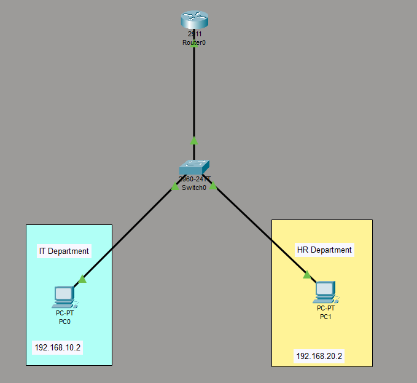
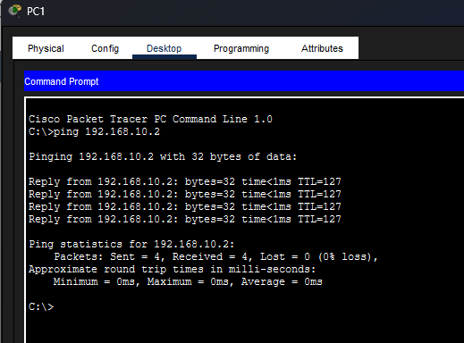

# 🌐 VLAN Inter-VLAN Routing Project

## 📌 Description

This project demonstrates how to configure VLANs and enable communication between them using **Router-on-a-Stick** in Cisco Packet Tracer.

The network is divided into multiple VLANs for better segmentation, and a router is used to allow devices in different VLANs to communicate.

---

## 🧩 Topology

* 1 Switch (Cisco 2960)
* 1 Router
* 2 PCs
* Trunk link between Switch and Router

---

## 🏷️ VLAN Configuration

| VLAN ID | Name | Device |
| ------- | ---- | ------ |
| 10      | IT   | PC0    |
| 20      | HR   | PC1    |

---

## 🌐 IP Addressing

| Device | IP Address   | Subnet Mask   | Gateway      |
| ------ | ------------ | ------------- | ------------ |
| PC0    | 192.168.10.2 | 255.255.255.0 | 192.168.10.1 |
| PC1    | 192.168.20.2 | 255.255.255.0 | 192.168.20.1 |

---

## ⚙️ Switch Configuration

```
enable
configure terminal

vlan 10
name IT

vlan 20
name HR

interface fa0/1
switchport mode access
switchport access vlan 10

interface fa0/2
switchport mode access
switchport access vlan 20

interface fa0/24
switchport mode trunk
```

---

## ⚙️ Router Configuration

```
enable
configure terminal

interface g0/0
no shutdown

interface g0/0.10
encapsulation dot1Q 10
ip address 192.168.10.1 255.255.255.0

interface g0/0.20
encapsulation dot1Q 20
ip address 192.168.20.1 255.255.255.0
```

---

## 🖥️ PC Configuration

### PC0 (VLAN 10)

* IP: 192.168.10.2
* Subnet: 255.255.255.0
* Gateway: 192.168.10.1

### PC1 (VLAN 20)

* IP: 192.168.20.2
* Subnet: 255.255.255.0
* Gateway: 192.168.20.1

---

## 🔌 Trunk Explanation

A trunk port allows multiple VLANs to pass through a single link between devices (Switch ↔ Router).
This project uses IEEE 802.1Q tagging to identify VLAN traffic.

---

## 🧪 Test Result

Successful communication between VLANs:

```
PC1> ping 192.168.10.2

Reply from 192.168.10.2: bytes=32 time<1ms TTL=128
```

---

## 📸 Screenshots

### 🔹 Network Topology



### 🔹 Ping Success



---

## 📁 Project Files

* vlan-intervlan-project.pkt
* /images (screenshots)
* README.md

---

## 🚀 Key Features

* VLAN segmentation
* Trunk configuration
* Inter-VLAN routing
* Successful connectivity testing

---

## 🧠 Learning Outcome

* Understanding VLANs and network segmentation
* Configuring trunk ports
* Implementing Router-on-a-Stick
* Verifying connectivity using ping

---

## 👨‍💻 Author

Hasitha Ramesh
GitHub: https://github.com/hasitha-ramesh
